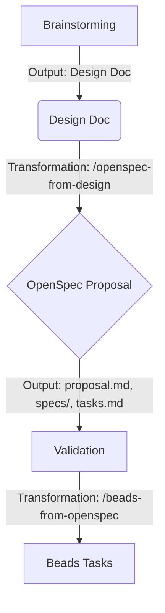

# Design: OpenSpec-Beads Integration

## Overview

This design defines the architecture for the "Brainstorming -> Spec -> Beads" pipeline. The goal is to maximize automation while preserving the value of rigorous thinking at each stage.

## Architecture

### 1. The Pipeline



### 2. Transformation Layers

#### A. Design -> Spec (`/openspec-from-design`)

**Input**: `docs/plans/YYYY-MM-DD-feature.md`
**Process**:

- Extract "Problem Statement" -> `proposal.md` (Motivation)
- Extract "Proposed Changes" -> `specs/feature/spec.md` (Requirements)
- Extract "Verification" -> `specs/feature/spec.md` (Scenarios)
- Extract "Implementation Plan" -> `tasks.md`

**Challenge**: Design docs are natural language.
**Solution**: Use a robust LLM prompt (via Agent) to perform the mapping, as strict parsing will be brittle. The workflow will be "agent-driven".

#### B. Spec -> Beads (`/beads-from-openspec`)

**Input**: `openspec/changes/<id>/tasks.md`
**Process**:

- Read `tasks.md` (ordered list).
- For each item:
  - Create Bead task.
  - Link to the Spec (Requirement ID) if available.
  - Set dependency based on list order (optional via flag).

### 3. Workflow Integration

We will modify `/superpower-brainstorming` to end with a prompt:
"Do you want to formalize this as an OpenSpec Proposal?" -> Triggers `/openspec-from-design`.

We will create `/openspec-apply` (or hook into it) to trigger `/beads-from-openspec` when a spec is "accepted" for implementation.

## Data Models

**OpenSpec Tasks (`tasks.md`)**:
Standard list format:

```markdown
1. Setup base project structure
2. Implement Core Feature X
   - Validation: Unit tests pass
```

**Beads Task**:

```bash
bd create "Implement Core Feature X" --description "Ref: openspec/changes/<id>/specs/feature"
```

## Alternatives Considered

- **Skip OpenSpec**: Go Design -> Beads directly.

  - _Pro_: Faster.
  - _Con_: Loses the rigorous "Requirement/Scenario" check that OpenSpec provides.
  - _Decision_: Support both. Use OpenSpec for complex features (Rule of Five).

- **Beads as Source of Truth for Specs**:
  - _Pro_: Single tool.
  - _Con_: Beads is for _doing_, Specs are for _defining_. Mixing them creates noise.
