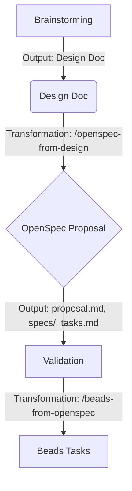

# Design: OpenSpec-Beads Integration

[See original design doc](file:///Users/dat/workspace/dotfiles/docs/plans/2025-12-28-openspec-beads-integration-design.md)

## Architecture

### The Pipeline

### Transformation Layers

#### Design -> Spec (`/openspec-from-design`)

**Input**: `docs/plans/feature.md`
**Process**:

- Extract "Problem Statement" -> `proposal.md`
- Extract "Proposed Changes" -> `specs`
- Extract "Implementation Plan" -> `tasks.md`

#### Spec -> Beads (`/beads-from-openspec`)

**Input**: `openspec/changes/<id>/tasks.md`
**Process**:

- Create Beads Epic.
- Create child tasks for each item.
- Link tasks to Spec Scenarios.

### Data Models

**OpenSpec Tasks (`tasks.md`)**:
Ordered list of high-level implementation steps.

**Beads Task**:
Actionable work unit with dependencies and verification criteria.
